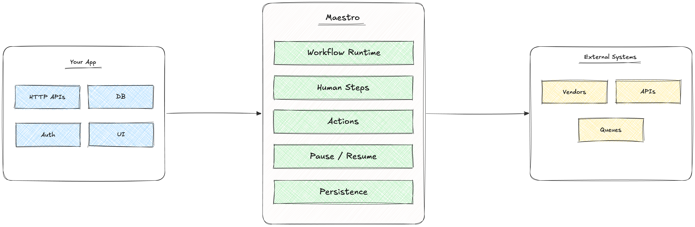

<div align="center">

# Maestro - embedded workflow runtime

Human-in-the-loop workflows for KYC and onboarding.

[](https://pkg.go.dev/github.com/justinush/maestro)
[](https://github.com/justinush/maestro/actions/workflows/ci.yml)
[](https://goreportcard.com/report/github.com/justinush/maestro)
[](./LICENSE)
[](https://github.com/justinush/maestro/releases)

**[Introduction](#introduction) &nbsp;&nbsp;&bull;&nbsp;&nbsp;**
**[Quick Start](#quick-start) &nbsp;&nbsp;&bull;&nbsp;&nbsp;**
**[Examples](#examples) &nbsp;&nbsp;&bull;&nbsp;&nbsp;**
**[Architecture](#architecture) &nbsp;&nbsp;&bull;&nbsp;&nbsp;**
**[Changelog](#changelog) &nbsp;&nbsp;&bull;&nbsp;&nbsp;**
**[Roadmap](#roadmap) &nbsp;&nbsp;&bull;&nbsp;&nbsp;**
**[Contributing](#contributing)**

</div>

---

## Introduction

Maestro is an embedded workflow orchestration runtime originally designed for KYC and onboarding systems.

It helps backend applications execute long-running flows involving:

- human approval steps
- external vendor actions
- pause/resume execution
- persistence + restore
- workflow-driven orchestration

Unlike orchestration platforms that require separate infrastructure, Maestro runs directly inside your Go application as a library.

Typical use cases:

- KYC onboarding
- manual review systems
- fintech operations
- multi-step onboarding
- backoffice workflows
- approval flows

---

## Quick Start

### Library (embedding)

```bash
go get github.com/justinush/maestro@v0.1.1
```

Pin a release tag in production; `@latest` works for trying the module locally.

### CLI

```bash
go install github.com/justinush/maestro/cmd/maestro@v0.1.1
maestro --version
```

Or download a binary from [GitHub Releases](https://github.com/justinush/maestro/releases) — e.g. `maestro_v0.1.1_darwin_arm64.tar.gz` on macOS, or `.zip` on Windows. Check `SHA256SUMS` on the release page when verifying downloads.

### Minimal example

```go
package main

import (
	"fmt"

	"github.com/justinush/maestro/pkg/engine"
	"github.com/justinush/maestro/pkg/maestro"
)

func main() {
	rt, err := maestro.Load("workflow.yaml")
	if err != nil {
		panic(err)
	}

	in, err := rt.NewInstance(maestro.InstanceOptions{})
	if err != nil {
		panic(err)
	}

	res := in.RunUntilBlocked()

	switch res.Status {
	case engine.RunBlocked:
		fmt.Println("workflow paused for human input")

	case engine.RunCompleted:
		fmt.Println("workflow completed")

	case engine.RunFailed:
		panic(res.Err)
	}
}
```

Example workflow:

```yaml
schemaVersion: "0.1"

id: onboarding
version: "1.0.0"

initialStepId: collect-profile
terminalStepIds:
  - approved

steps:
  - id: collect-profile
    kind: human

  - id: approved
    kind: end

transitions:
  - from: collect-profile
    to: approved
```

### Multiple workflows

For apps that host more than one workflow definition, use **`pkg/workflow`** (optional — single-workflow apps can keep using `maestro.Load` above).

This is a **workflow registry** (maps workflow `id` + `version` to a validated runtime). It is not the **action registry** (`engine.Registry` / `RegistryWithHTTP`), which dispatches step action types like `stub` and `http`.

```go
import (
	"github.com/justinush/maestro/pkg/maestro"
	"github.com/justinush/maestro/pkg/validate"
	"github.com/justinush/maestro/pkg/workflow"
)

reg, err := workflow.LoadDir("workflows", validate.Options{})
if err != nil {
	return err
}

key := workflow.Key{ID: "kyc.sg.main", Version: "1.0.0"}

in, err := reg.NewInstance(key, maestro.InstanceOptions{
	RunID: "run_123",
})
```

Your app still owns product routing (for example country + flow type -> `workflow.Key`). Maestro resolves `id` + `version` to a runtime. Persisted runs store `workflowId` and `workflowVersion` on `RunRecord`; resume with `reg.RestoreInstance(rec, maestro.InstanceOptions{...})`.

### Custom action types

Built-in YAML action types are `stub` and `http`. Register app-owned runners on `engine.Registry` and allow them at load time:

```go
actionReg := engine.NewRegistry()
actionReg.MustRegister("stub", engine.NewStubRunner())
actionReg.MustRegister("vendor-create-session", vendorCreateRunner)

reg, err := workflow.LoadDir("workflows", validate.Options{
    AllowedActionTypes: []string{"vendor-create-session"},
})

in, err := reg.NewInstance(key, maestro.InstanceOptions{
    ActionRegistry: actionReg,
})
```

See [Custom action types](docs/design/custom-actions.md).

---

## Embedding (canonical path)

Use **`pkg/maestro`** as the main embedding API. Lower-level packages (`pkg/engine`, `pkg/run`) are for advanced customization.

```txt
maestro.Load*
    -> Runtime.NewInstance
    -> RunUntilBlocked
    -> SubmitInput (when blocked)
```

Persistence across HTTP requests:

```txt
run.RecordFromInstance -> Store.Create / Store.Save
Store.Get -> rt.RestoreInstance   (preferred)
```

Example restore (same workflow definition as when the run started):

```go
rec, err := runs.Get(ctx, runID)
if err != nil {
	return err
}
in, err := rt.RestoreInstance(rec, maestro.InstanceOptions{
	ActionRegistry: reg, // same registry semantics as NewInstance
})
```

For custom `Store` implementations, `run.InstanceFromRecord` is the lower-level equivalent of `RestoreInstance`.

Provide your own `*http.Client` with `engine.RegistryWithHTTP(client)` for HTTP actions in production; the CLI `simulate` command uses an internal long-timeout client and does not export it from `pkg/engine`.

---

## Architecture

Maestro follows an embedded orchestration model.

Your application owns:

- HTTP APIs
- authentication
- business data
- UI
- database models

Maestro owns:

- workflow graph execution
- orchestration lifecycle
- transitions
- human steps
- execution trace



---

## Examples

The repository includes progressively more advanced examples.

| Example | Purpose |
|---|---|
| [`library-basic`](./examples/demos/library-basic) | smallest embedding example |
| [`embed-kyc-service`](./examples/demos/embed-kyc-service) | pause/resume + persistence |
| [`http-runner`](./examples/demos/http-runner) | external HTTP actions |
| [`kyc-backend`](./examples/apps/kyc-backend) | realistic backend integration |

---

## Core Concepts

### Runtime

A loaded and validated workflow definition.

```go
rt, err := maestro.Load("workflow.yaml")
```

### Instance

A running workflow execution.

```go
in, err := rt.NewInstance(maestro.InstanceOptions{})
```

### Human Steps

Execution pauses until the application submits input.

```go
sub := in.SubmitInput(...)
```

### Persistence

Workflow runs are stored separately from your business data.

```go
rec := run.RecordFromInstance(in, def, revision) // revision 0 before Create
err = store.Create(ctx, rec)                     // stored revision becomes 1

rec, err = store.Get(ctx, runID)                 // read current revision
// ... mutate via SubmitInput / RunUntilBlocked ...
err = store.Save(ctx, rec)                       // requires matching revision
```

Restore on a later request (canonical path):

```go
in, err := rt.RestoreInstance(rec, maestro.InstanceOptions{})
```

`Store.Save` returns `run.ErrRevisionConflict` when another request updated the run first (optimistic locking).

See [architecture notes](./docs/architecture.md#persistence-model) for details.

#### Postgres store

For durable backends, use the official Postgres adapter in `pkg/run/postgres`:

```go
import (
	"context"

	"github.com/jackc/pgx/v5/pgxpool"
	"github.com/justinush/maestro/pkg/run/postgres"
)

pool, err := pgxpool.New(ctx, databaseURL)
if err != nil {
	return err
}
// Ensure workflow_runs exists (see schema note below).
store := postgres.NewStore(pool) // implements run.Store
```

**Schema:** `pkg/run/postgres/schema.sql` defines `workflow_runs` (intended stable across v0.x). Either:

- **`postgres.ApplySchema`** — optional, idempotent helper for examples, tests, and local dev.
- **Your migration tool** — copy `schema.sql` or use `postgres.SchemaDDL()` in goose, golang-migrate, Atlas, etc.

Production apps usually prefer the second option. [`run.NewMemoryStore`](./pkg/run/memory.go) remains for in-process tests and demos only.

### Actions

Workflow steps can execute external logic through registered runners.
Embedders supply their own HTTP client:

```go
reg := engine.RegistryWithHTTP(client)
```

---

## Repository Structure

| Path | Purpose |
|---|---|
| `pkg/maestro` | **canonical** embedding API (start here) |
| `pkg/workflow` | optional multi-workflow registry (`LoadDir`, `Registry`) |
| `pkg/engine` | workflow runtime (advanced; action registry) |
| `pkg/run` | persistence types and `Store` |
| `pkg/run/postgres` | Postgres `Store` adapter (JSONB, optimistic locking) |
| `pkg/definition` | workflow schema + decoding |
| `pkg/validate` | workflow validation |
| `examples/demos` | focused learning examples |
| `examples/apps` | near real-world applications |

---

## Project Status

Latest release: **v0.1.1** (CLI version reporting and cross-platform binaries). Maestro is still early `v0.x` — APIs may evolve before v1.

See [CHANGELOG.md](./CHANGELOG.md) for release notes and [docs/roadmap.md](./docs/roadmap.md) for what's next.

**Stability for v0.x:** JSON field names on `run.RunRecord`, `engine.Snapshot`, and `engine.Event`, plus `RunStatus` / `SubmitInputStatus` values, are treated as stable. Breaking changes to those shapes will require a major version bump.

---

## Changelog

Release notes: [CHANGELOG.md](./CHANGELOG.md).

---

## Roadmap

Direction and priorities: [docs/roadmap.md](./docs/roadmap.md).

**v0.2 (in progress):** `pkg/workflow` registry. **Next:** versioning, async callbacks, retries/timers, observability. See [roadmap](./docs/roadmap.md).

---

## Why Maestro?

Maestro focuses on:

- embedded-first architecture
- readable workflows
- human + system orchestration
- backend-oriented integration
- application-owned control
- simple runtime embedding

The goal is to make workflow orchestration feel natural inside normal backend services.

---

## Contributing

Contributions, feedback, and discussions are welcome.

Helpful links:

- [changelog](./CHANGELOG.md)
- [roadmap](./docs/roadmap.md)
- [examples](./examples)
- [architecture notes](./docs/architecture.md)
- [contributing guide](./CONTRIBUTING.md)

---

## License

[MIT](./LICENSE)
