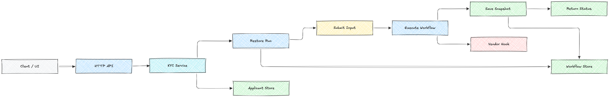

# kyc-backend

Minimal HTTP API that embeds Maestro like a real KYC service.

This example shows how a backend service can:

- restore a workflow run per request
- submit user input into Maestro
- drive the workflow forward
- persist workflow snapshots
- return UI-friendly status responses

Unlike the smaller demos under `examples/demos/`, this app demonstrates a near real-world request/response integration shape.

<p align="center">
  
</p>

---

## Workflow

```txt
collect-profile -> document-upload -> run-liveness-check -> approved
                                              \-> manual-review -> approved
```

Passport uploads require manual review. Other document types auto-approve after liveness.

---

## HTTP API

```txt
POST /kyc/start
GET  /kyc/{runID}
GET  /kyc/{runID}/events
POST /kyc/{runID}/profile
POST /kyc/{runID}/document
POST /kyc/{runID}/review
```

Mutating requests follow the same lifecycle:

```txt
restore run -> validate step -> SubmitInput -> RunUntilBlocked -> save snapshot -> return status
```

---

## What this demo shows

- embedding Maestro behind REST handlers
- workflow persistence + restore per request
- `SubmitInput` on human steps
- app-owned business data beside workflow state
- step-to-status mapping for frontend APIs
- execution trace via `/events`
- workflow-first orchestration flow

---

## Run

From the repository root:

```bash
go run ./examples/apps/kyc-backend
```

Server listens on `:8080`.

Override:

```bash
ADDR=:9000 go run ./examples/apps/kyc-backend
```

---

## Example flow

Start a KYC run:

```bash
curl -s -X POST http://localhost:8080/kyc/start | jq
```

Save the returned run id:

```bash
export RUN_ID=run_xxxxxxxx
```

Submit profile:

```bash
curl -s -X POST "http://localhost:8080/kyc/${RUN_ID}/profile" \
  -H 'Content-Type: application/json' \
  -d '{
    "fullName":"Justin",
    "email":"justin@maestro.io"
  }' | jq
```

Submit document:

```bash
curl -s -X POST "http://localhost:8080/kyc/${RUN_ID}/document" \
  -H 'Content-Type: application/json' \
  -d '{
    "documentType":"national_id",
    "documentRef":"doc-123"
  }' | jq
```

Read current status:

```bash
curl -s "http://localhost:8080/kyc/${RUN_ID}" | jq
```

Read execution trace:

```bash
curl -s "http://localhost:8080/kyc/${RUN_ID}/events" | jq
```

---

## Manual review path

Passport documents route to manual review:

```bash
curl -s -X POST "http://localhost:8080/kyc/${RUN_ID}/document" \
  -H 'Content-Type: application/json' \
  -d '{
    "documentType":"passport",
    "documentRef":"pass-456"
  }' | jq
```

Approve review:

```bash
curl -s -X POST "http://localhost:8080/kyc/${RUN_ID}/review" \
  -H 'Content-Type: application/json' \
  -d '{
    "approved": true
  }' | jq
```

Typical statuses:

```txt
awaiting_profile
awaiting_document
awaiting_review
approved
```

---

## Project structure

| File | Purpose |
|---|---|
| `main.go` | HTTP server entrypoint |
| `handlers.go` | REST routes + strict JSON decoding |
| `service.go` | workflow lifecycle orchestration |
| `status.go` | UI-facing response mapping |
| `errors.go` | sentinel app errors |
| `applicant_store.go` | app-owned business data |
| `maestro_store.go` | workflow persistence helpers |
| `vendor.go` | fake vendor integration hook |
| `workflow.go` | embedded workflow loader |
| `workflow.yaml` | sample KYC workflow |

---

## Real-world mapping

| Demo piece | Production equivalent |
|---|---|
| HTTP handlers | API layer |
| `ApplicantStore` | database / CRM |
| `run.Store` | workflow persistence storage |
| `SubmitInput` | form submission |
| `/events` | support/debug trace |
| `status.go` | frontend DTO mapping |

In production:

- replace `MemoryStore` with a real database
- replace the fake vendor with HTTP actions (`examples/demos/http-runner`)
- add auth, retries, observability, and async callbacks

---

## Related examples

- [`library-basic`](../../demos/library-basic) — smallest embedding example
- [`embed-kyc-service`](../../demos/embed-kyc-service) — pause/resume + persistence
- [`http-runner`](../../demos/http-runner) — HTTP actions from workflows
