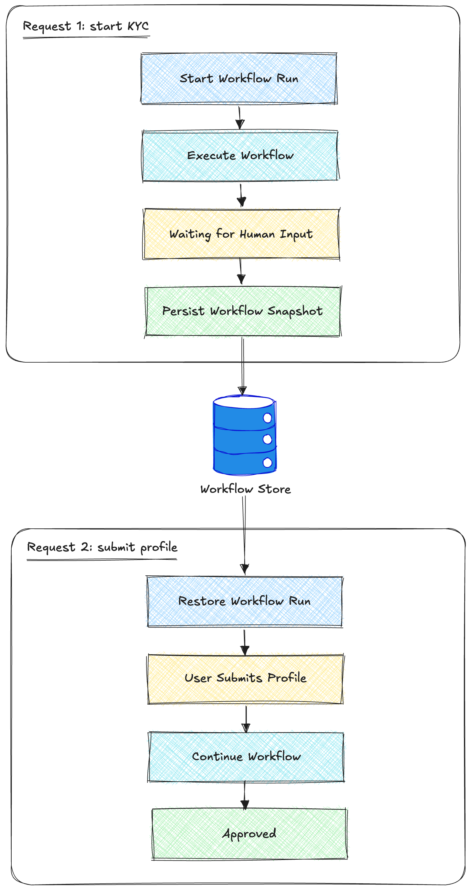

# embed-kyc-service

Minimal embedded KYC workflow lifecycle with persistence + restore.

<p align="center">
  
</p>

This demo simulates two backend requests sharing the same persisted workflow run.

```txt
request 1 -> start workflow -> blocked -> persist
request 2 -> restore workflow -> submit input -> continue -> approved
```

The workflow pauses on a human step, saves its state, then resumes later after new input arrives.

---

## What this demo shows

- embedded workflow execution inside a backend service
- blocking on a human step
- persisting workflow snapshots
- restoring workflow state in a later request
- continuing execution with `SubmitInput`
- workflow trace inspection

This is the recommended starting point for building real onboarding or approval flows on top of Maestro.

---

## Run

From the repository root:

```bash
go run ./examples/demos/embed-kyc-service
```

---

## Expected output

```txt
created run: run_demo
blocked at: collect-profile

restored run from store

submitting profile input...
continued to: run-checks
completed at: approved
saved final run state

trace:
...
```

Trace lines may differ slightly as the engine evolves.

---

## Files

| File | Purpose |
|---|---|
| `main.go` | entrypoint |
| `scenario.go` | workflow lifecycle scenario |
| `persist.go` | persistence + restore helpers |
| `workflow.go` | embedded workflow loader |
| `workflow.yaml` | sample KYC workflow definition |

---

## Real-world mapping

This demo roughly maps to:

| Backend request | Responsibility |
|---|---|
| Request 1 | start onboarding workflow |
| Request 2 | receive user profile form |
| Workflow store | persist workflow snapshots between requests |

In production, use [`pkg/run/postgres`](../../../pkg/run/postgres) for `run.Store` instead of `MemoryStore`.

---

## Next demo

Continue with [`http-runner`](../http-runner) to see:

- external HTTP integrations
- vendor/API orchestration
- workflow guards based on HTTP responses
