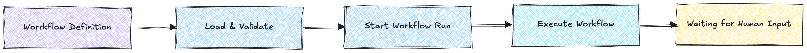

# library-basic

Smallest possible Maestro embedding example.

<p align="center">
  
</p>

This demo shows the minimum workflow lifecycle:

```txt
workflow.yaml -> maestro.Load -> Runtime.NewInstance -> RunUntilBlocked
```

The engine executes until the workflow either:

- reaches a terminal step
- or pauses on a human step and returns control back to your app

---

## What this demo shows

- load and validate a workflow
- start a workflow run
- execute until blocked or completed
- inspect workflow status from `RunResult`

This is the smallest useful embedding path before persistence, restore, or external integrations.

---

## Run

From the repository root:

```bash
go run ./examples/demos/library-basic examples/workflows/workflow-v0-minimal.yaml
```

---

## Expected output

With the default `workflow-v0-minimal.yaml`:

```txt
loaded workflow "workflow-v0-minimal" (version "1.0.0")
blocked at "collect-profile" (needs input — see examples/demos/embed-kyc-service)
```

If you point at a different workflow, the step or outcome may differ.

---

## Files

| File | Purpose |
|---|---|
| `main.go` | minimal embedding lifecycle |
| `workflow-v0-minimal.yaml` | sample workflow definition |

---

## Next demo

Continue with [`embed-kyc-service`](../embed-kyc-service) to see:

- persistence
- restore from storage
- `SubmitInput`
- multi-request workflow lifecycle
